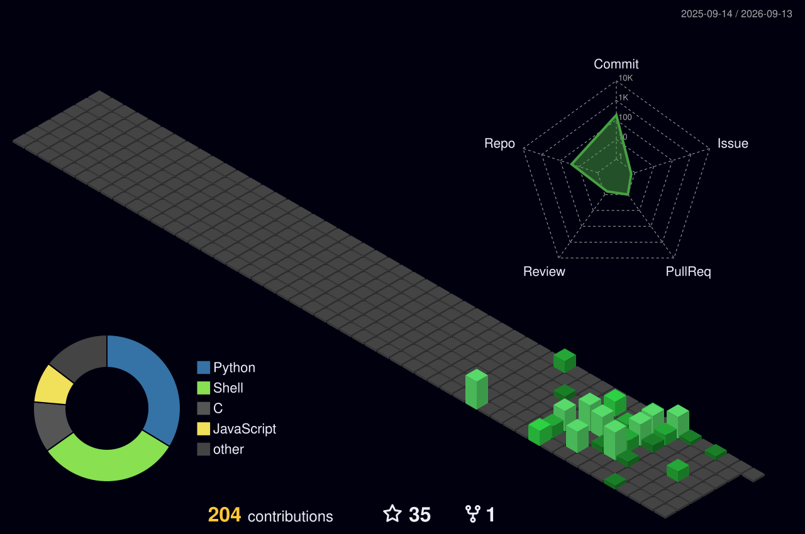

<div align="center">


</div>

<p align="center">
  
  &nbsp;
  
  &nbsp;
  
</p>

<br>

<p align="center">
  
</p>

<br>

```
┌─[venu@kali]─[~]
├── $ whoami
│   → security researcher · bug bounty hunter · tiruvannamalai, india
│
├── $ ls ~/arsenal/
│   → ssh-bruteforce/    # multi-threaded SSH auth testing (paramiko)
│   → Portscanner/       # custom TCP port scanner (socket)
│   → recon/             # subdomain enum + WHOIS (sublist3r)
│   → full-recon/        # recon pipeline: subfinder → httpx → nuclei
│   → keylogger/         # input monitoring tool (pynput)
│   → JSScope/           # JS endpoint extractor for webapp recon
│
├── $ cat /etc/targets
│   → HackerOne  · Bugcrowd · Web Apps · APIs
│
└── $ echo $STATUS
    → hunting bugs · writing exploits · automating recon
```

<br>


<br>

## ❄️ What I'm Up To

<table>
<tr>
<td>

```yaml
offensive_tooling:
  python:
    - ssh-bruteforce    # paramiko + threading
    - Portscanner       # raw socket scanning
    - recon             # sublist3r + whois + requests
    - keylogger         # pynput keystroke capture
    - JSScope           # JS file endpoint extraction
  bash:
    - full-recon        # subfinder → httpx → waybackurls → nmap → nuclei

current_focus:
  - 🎯 Hunting web app & API vulnerabilities
  - 🔗 Chaining recon tools into automated pipelines
  - 🕵️ OSINT & subdomain enumeration at scale
  - 📡 Leveling up in SOC & threat analysis
  - 🔴 Studying red team fundamentals

platforms:
  hackerone: venu-sh
  bugcrowd: venu-sh

philosophy: >
  Break it, report it, fix it.
  No harm — just protection.
```

</td>
</tr>
</table>

<br>

<p align="center">
  <a href="https://hackerone.com/venu-sh?type=user"></a>
  &nbsp;
  <a href="https://bugcrowd.com/h/venu-sh"></a>
  &nbsp;
  <a href="https://github.com/Venu-exe"></a>
</p>

<br>


<br>

## 🧊 Arsenal

<p align="center">
  
</p>

<br>

<div align="center">

| Domain | Skill | Level |
|:--:|:--|:--|
| 🐍 | **Python Offensive Tooling** |  |
| 🌐 | **Web App Security** |  |
| 📜 | **Bash / Shell Automation** |  |
| 🔍 | **Recon & OSINT** |  |
| 🔗 | **Tool Chaining & Pipelines** |  |
| 🌍 | **Networking & Port Scanning** |  |
| 🛡️ | **SOC & Threat Intel** |  `learning` |
| 🔴 | **Red Teaming** |  `learning` |

</div>

<br>


<br>

## 🛠️ Featured Repos

<div align="center">

<a href="https://github.com/Venu-exe/full-recon">
  
</a>
&nbsp;
<a href="https://github.com/Venu-exe/ssh-bruteforce">
  
</a>

<br>

<a href="https://github.com/Venu-exe/recon">
  
</a>
&nbsp;
<a href="https://github.com/Venu-exe/Portscanner">
  
</a>

<br>

<a href="https://github.com/Venu-exe/keylogger">
  
</a>
&nbsp;
<a href="https://github.com/Venu-exe/JSScope">
  
</a>

</div>

<br>


<br>

## 📊 Stats

<p align="center">
  
  &nbsp;
  
</p>

<p align="center">
  
</p>

<p align="center">
  
</p>

<br>


<br>

## 🐍 Contribution Snake

<p align="center">
  
</p>

<br>

## 🧊 3D Contribution Graph

<p align="center">
  
</p>

<br>


<br>

<div align="center">

```
 ╔══════════════════════════════════════════════════════════════╗
 ║                                                              ║
 ║   "The quieter you become, the more you are able to hear."   ║
 ║                                        — Kali Linux          ║
 ║                                                              ║
 ╚══════════════════════════════════════════════════════════════╝
```

</div>

<br>


<p align="center">
  
</p>
